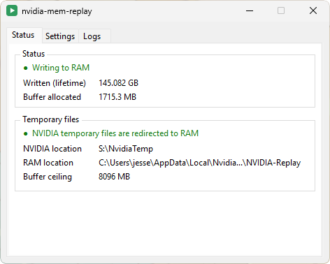

# nvidia-mem-replay

  

**Use RAM for NVIDIA Instant Replay’s temporary recordings.**  
Recording at high bit-rates introduces unnecessary wear on your SSD, with potential for easily 100's of gigabytes of writes in a single session. This lowers writes by holding the rolling temporary recordings in memory until you choose choose to save them.

You need **64-bit Windows**, an **NVIDIA GPU**, and **Instant Replay** working in the NVIDIA overlay.

## Get started

1. Download **`nvidia-mem-replay-setup-x64.exe`** from the [Releases page](https://github.com/malinoskj2/nvidia-mem-replay/releases) and run it. WinFsp is included; Windows may ask for admin access or a reboot.
2. Launch **nvidia-mem-replay** from the Start menu. The app switches NVIDIA's temporary-files location to RAM storage. The RAM volume is invisible: it has no drive letter and does not appear in Explorer, This PC or file dialogs. To change the RAM limit, set it in **Settings**, then click **Apply and restart**. The default limit is **8192 MB**; leave enough RAM for your game and Windows.
3. Save clips as usual. Pre-save, the temporary recording is in RAM. Once saved it will persist to disk at your usual location (defined in Nvidia App).

## While you play

- The **Logs** tab lists what the app did (redirections, Instant Replay cycles, stops) and any errors. The same lines are written to `%LOCALAPPDATA%\NvidiaMemReplay\nvidia-mem-replay.log`, replaced on each launch, which is the file to attach to a bug report.
- **Close the window** to keep it running in the tray. Click the tray icon to reopen it; right-click it for **Stop and restore** and **Quit**. If the tray is unavailable, closing quits the app.
- **Stop and restore** (Settings tab or tray menu) stops RAM recording and restores NVIDIA’s original temporary folder.
- **Start with Windows** (Settings tab) starts the app hidden in the tray at sign-in. It waits for the NVIDIA App to come up before redirecting, so the order the two start in does not matter.
- If the NVIDIA App or its overlay restarts while the app is running, NVIDIA resets its temporary folder; the app notices within about ten seconds and redirects it to RAM again.

**Save any clips you want before stopping, quitting, restarting, or shutting down your PC.** The temporary RAM buffer disappears; clips already saved to Gallery stay on disk.

## Quick fixes

- If recording doesn’t start, toggle Instant Replay off and on in **Alt+Z**.
- If the app reports that ShadowPlay could not be reached, open the NVIDIA overlay once with **Alt+Z** so the NVIDIA App’s background services are running, then click **Retry / start**.
- If memory runs low, lower the RAM limit in **Settings**.
- If shutdown fails, follow the message in the app and choose **Retry shutdown**.

Windows can still page RAM to disk, so this does not guarantee zero disk writes.

## Credits

Built on the work of these projects and their contributors:

- [**WinFsp**](https://github.com/winfsp/winfsp) — the Windows filesystem driver that makes the RAM drive possible.
- [**WinFsp-MemFs-Extended**](https://github.com/Ceiridge/WinFsp-MemFs-Extended) by **Ceiridge** — the dynamically allocated RAM filesystem behind this app.
